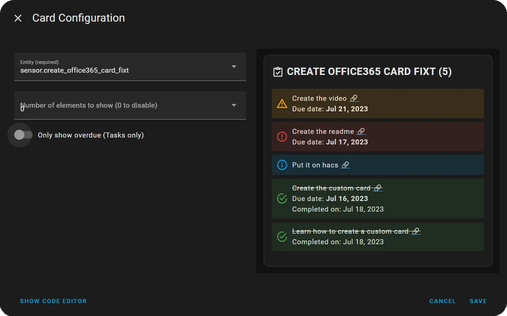

<a name="readme-top"></a>

[](https://github.com/fixtse/office365-card/actions/workflows/github-actions-hacs.yml)
[](https://github.com/hacs/integration)

[](https://github.com/fixtse/office365-card/releases/latest) [](#) [](https://github.com/fixtse)


# Office 365 Card for Home Assistant

Table of contents
-----------------

* [Introduction](#introduction)
* [Installation](#installation)
* [Supported Types](#supported-types)
  * [Inbox](#inbox)
  * [To Do](#to-do)
  * [Teams](#teams)

## Introduction
Needs the [Office 365 Integration](https://github.com/RogerSelwyn/O365-HomeAssistant) to work

[](http://www.youtube.com/watch?v=yKr5nMzOaAI "Integrating Office 365 into Home Assistant")

This is a Card to show information from your Office 365 sensors into your home assistant dashboard. The intend its to create a <b>simple</b> and easy to use card to show the sensors information in the dashboard.

I made a video about the Office 365 integration and on my research, I couldn't find any other card that allowed me to show the information from the sensors easily. So I made this card to simplify the process for everyone that needs it.

The Icon and the name of the card are taken from the sensor's configuration

Once installed can be added from the Dashboard Panel, just search for Office365 Card, works with the Lovelace Config Editor.

<p align="center"></p>

<p align="right">(<a href="#readme-top">back to top</a>)</p>

## Installation

### HACS (Recommended)

We are in the process of being added to the HACS default list of repositories, in the meantime, add this as a custom repository to install it through hacs.  So you can update easily when more features are added

```
https://github.com/fixtse/office365-card
```

### Manual

1. Download `office365-card.js` file from the [latest release](https://github.com/fixtse/office365-card/releases/latest).
2. Put `office365-card.js` file into your `config/www` folder.
3. Add a reference to `office365-card.js` in Lovelace.
   1. **Go to:** _Settings_ → _Dashboards_ → _Resources_ → Click Plus button → Set _Url_ as `/local/office365-card.js` → Set _Resource type_ as `JavaScript Module`.   
4. Add `custom:office365-card.js` to Lovelace UI as any other card (using either editor or YAML configuration).

## Supported Types

## Inbox
<p align="center"></p>

* The card shows the email list from an email sensor ([doc](https://rogerselwyn.github.io/O365-HomeAssistant/installation_and_configuration.html#email_sensors)) or a query sensor ([doc](https://rogerselwyn.github.io/O365-HomeAssistant/installation_and_configuration.html#query_sensors))
* State Color based on importance level of the email
  * Info: Normal
  * Alert: High

#### Options
| Name  | Requirement | Description | 
| --- | --- |  --- |
| type  | **Required** | `custom:office365-card` |
| entity | **Required**  | Home Assistant entity ID |
| max_items | Optional | Maximum amount of items to show in the card <br> The header counter will still show the real value <br> Set to 0 to show all  |
<p align="right">(<a href="#readme-top">back to top</a>)</p>

## To Do
<p align="center"></p>

* The card Lists the items from a tasks sensor ([doc](https://rogerselwyn.github.io/O365-HomeAssistant/sensor.html#taskto-do-sensor))
* By default the sensor only retrieves incomplete tasks, if you want to show completed ones too, you need to configure it on the tasks configuration file ([doc](https://rogerselwyn.github.io/O365-HomeAssistant/tasks_configuration.html#tasks-configuration))
* Each item has a link that will take you to the item's page on todo.office.com
* The State Color is based on the Due Date:
  * Warning : With Due Date, not overdue
  * Alert: With Due Date, overdue
  * Info: Without Due Date
  * Success: Completed task

#### Options
| Name | Requirement | Description | 
| --- | --- | --- |
| type  | **Required** | `custom:office365-card` |
| entity | **Required**  | Home Assistant entity ID |
| max_items | Optional | Maximum amount of items to show in the card <br> The header counter will still show the real value <br> Set to 0 to show all  |
| only_overdue | Optional | Only show overdue tasks <br> Default: false |

<p align="right">(<a href="#readme-top">back to top</a>)</p>

## Teams
<p align="center"></p>

* The card shows the information from the teams chat sensor ([doc](https://rogerselwyn.github.io/O365-HomeAssistant/sensor.html#teams-chat-sensor))
* Has a link that will open the conversation in teams.microsoft.com

#### Options
| Name | Requirement | Description | 
| --- | --- | --- |
| type  | **Required** | `custom:office365-card` |
| entity | **Required**  | Home Assistant entity ID |

<p align="right">(<a href="#readme-top">back to top</a>)</p>

## Licence
office365-card is [MIT licenced](license.txt)


